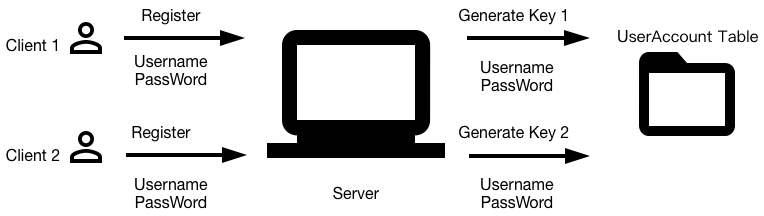
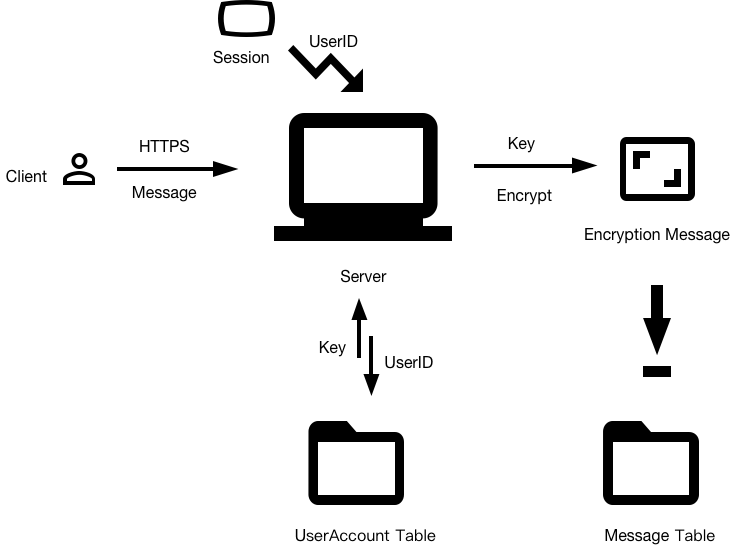
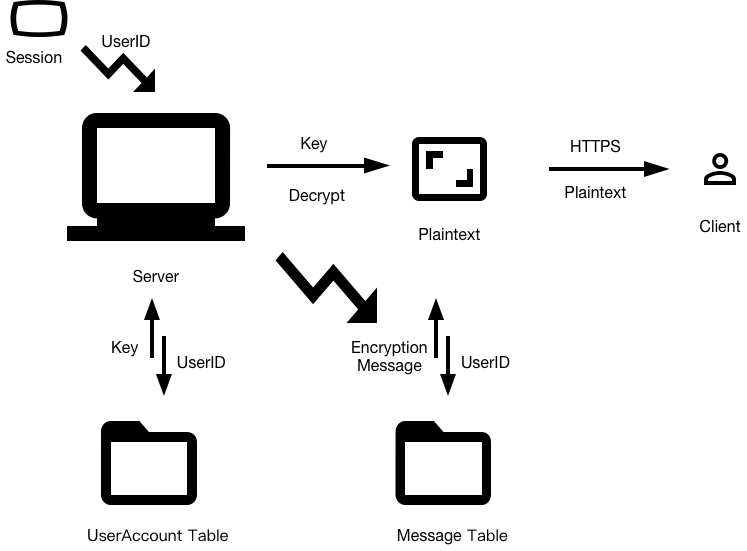
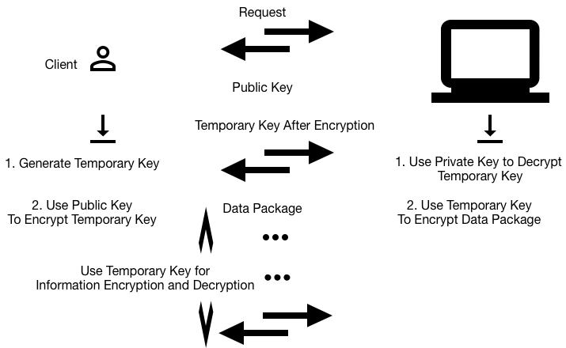
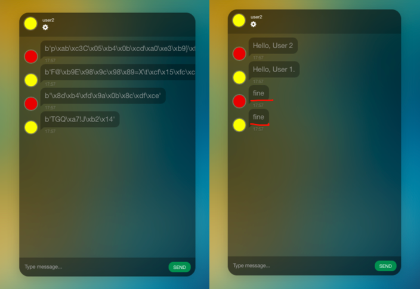

Chat_Flask
==============

Description
-----------

The demo of instan messenger can realize the real time communication and information security in transmission and data storage.

Dependencies
-----------
* Python 3
* Flask 
* Flask_login
* Flask_socketio
* Crypto

More details can be seen in requirements.txt

## Work Flow

### Register (Distribute An Unique Key For User)  

### Send Message 

### Get Message In Browser  

Why Security
-------------

### HTTPS (Transmission) 

### Without Decryption 

